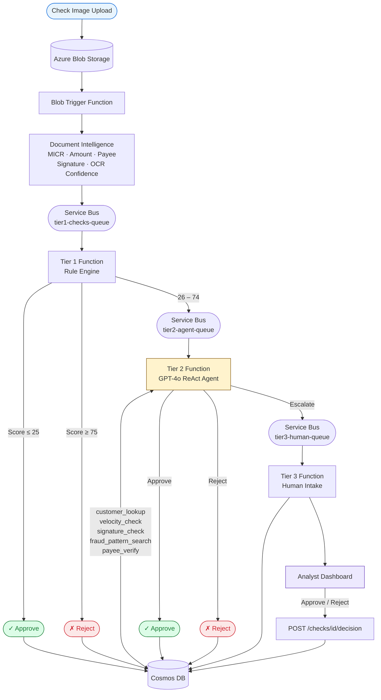

# Architecture

## End-to-End Pipeline



## Tier Responsibilities

### Blob Trigger
Fires on every new file uploaded to the `check-images` container. Calls Azure Document Intelligence to extract structured fields from the check image, then enqueues a JSON payload to `tier1-checks-queue`.

### Tier 1 — Rule Engine
A fast, deterministic scoring function. Runs four checks in sequence:

| Check | What it looks at | Max risk contribution |
|---|---|---|
| MICR Validation | Routing checksum, amount mismatch, payee match, alteration, signature, OCR confidence | 50 pts |
| Amount Validation | Near CTR threshold ($8,500–$9,999), large amount, zero/negative | 20 pts |
| Account Check | Account status, synthetic identity flag, KYC, account age vs amount | 50 pts |
| Velocity Check | Check count and cumulative amount in last 24h | 35 pts |

Decision gate: score ≤ 25 → approve · score ≥ 75 → reject · 26–74 → escalate to Tier 2.

### Tier 2 — GPT-4o ReAct Agent
An agentic loop (max 6 iterations, 30s timeout) that reasons across all signals. The agent starts with a `customer_lookup`, then decides which tools to call based on what it finds. It must call at least 3 tools before it can `escalate_to_human`. Ends with a structured JSON decision.

### Tier 3 — Human Review
Service Bus trigger sets `status = awaiting_analyst` in Cosmos. The analyst dashboard polls `/api/checks/queue` and presents the full context: escalation path scores, all fraud indicators split by tier, agent reasoning text, tool trace (key-value), and check image. Analyst approves or rejects; decision is written back to Cosmos immediately.

## Azure Resources

| Resource | SKU / Plan | Purpose |
|---|---|---|
| Function App `checkfraudagent` | Flex Consumption | Hosts all 4 functions |
| Storage Account `checkfraudstorage` | Standard LRS | Check images + Functions host |
| Service Bus namespace | Standard | 3 queues: tier1, tier2, tier3 |
| Cosmos DB `CheckFraudDB` | Serverless | checks, customers, audit_log, fraud_cases |
| Document Intelligence `checkfrauddoc` | S0 | Check field extraction |
| Azure OpenAI | gpt-4o deployment | Tier 2 agent |
| Application Insights | — | Distributed tracing |

## Cosmos DB Schema

### `checks` container (partition: `/id`)
Key fields written progressively as the check moves through tiers:

```
id, check_number, account_number, routing_number, customer_name
payee_name, amount, memo, issue_date, submission_date, bank_name
blob_path, check_image_url, status, created_at, updated_at

# After Tier 1
processing_tier, fraud_decision, risk_score, fraud_indicators
tier1_risk_score, tier1_indicators

# After Tier 2
fraud_pattern, agent_reasoning, agent_tool_calls, agent_iterations

# After Tier 3
tier3_assigned_at, analyst_decision, analyst_id, analyst_notes, tier3_completed_at
```

### `customers` container (partition: `/account_number`)
```
account_number, customer_name, account_status, kyc_verified
synthetic_identity_risk, avg_monthly_balance, opened_date
linked_accounts[], flags[]
```

### `audit_log` container (partition: `/check_id`)
One entry per tier per check — records tier, decision, timestamp, and details.

### `fraud_cases` container (partition: `/id`)
Knowledge base of known fraud patterns. Each case has `agent_signals[]` that the Tier 2 agent matches against during `fraud_pattern_search`.

## Deployment

CI/CD via GitHub Actions on push to `main`:
1. Run `pytest tests/`
2. Azure login via OIDC (no stored secrets — federated credential on service principal `check-fraud-agent-github`)
3. Zip `host.json requirements.txt function_app.py handlers/ dashboard.html`
4. Deploy via `az functionapp deployment source config-zip`

Live URL: `https://checkfraudagent.azurewebsites.net`
